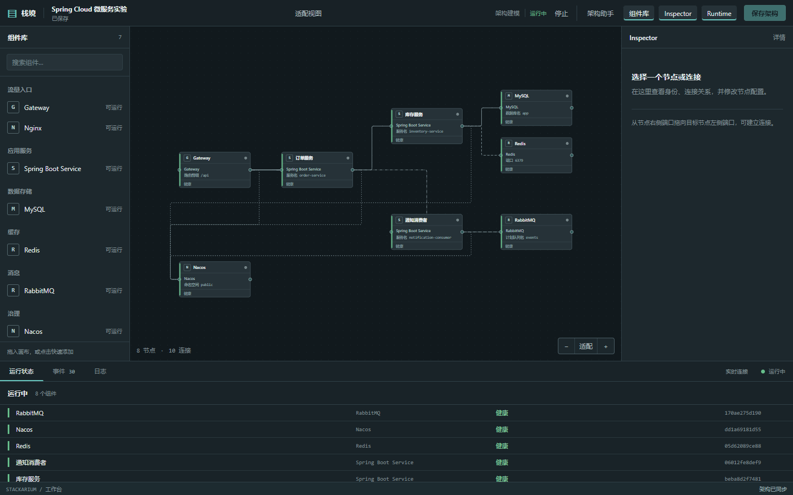
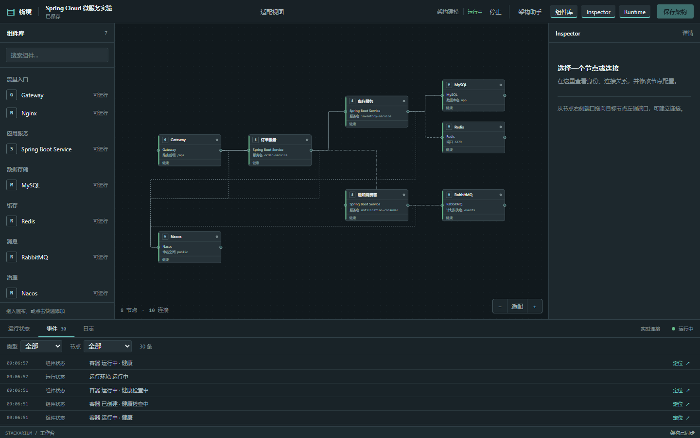
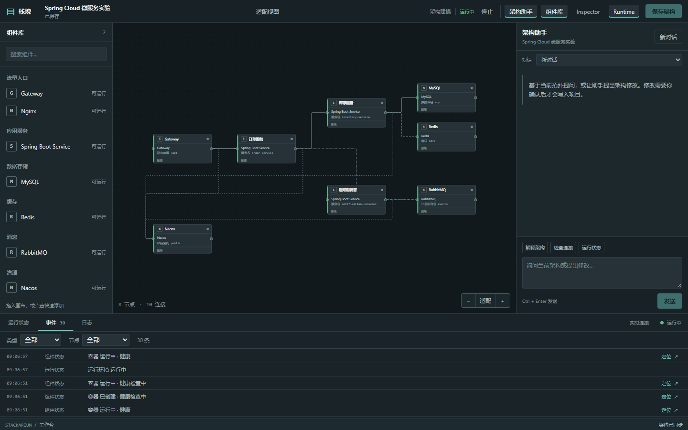
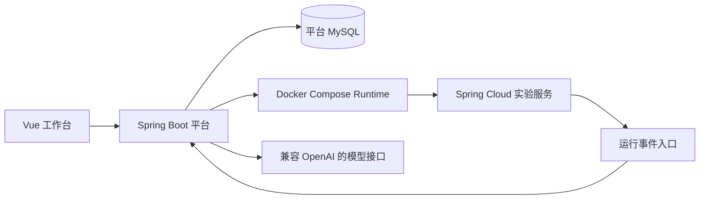

# Stackarium 栈境

Stackarium 将后端技术组件组织成可保存的架构拓扑，再把可运行拓扑转换为独立的 Docker Compose 实验环境。工作台同时展示节点关系、容器健康、请求链路、缓存和消息事件；架构助手可以解释当前拓扑，并通过待确认的修改建议更新它。

## 界面预览







## 核心能力

- **架构建模**：组件库、Vue Flow 画布、Inspector 配置、连接规则校验和拓扑修订号。保存后刷新可恢复节点、连接及位置。
- **可执行 Runtime**：插件声明服务贡献，平台生成 Runtime Plan 和 Compose 配置；Docker 的实际状态、健康检查与日志由平台观测。只有 Gateway 向本机发布实验端口。
- **微服务实验**：Gateway → 订单服务 → OpenFeign → 库存服务；Nacos 服务发现、MySQL 持久化、Redis cache-aside、RabbitMQ 订单消息和 Sentinel 订单接口限流均有真实调用路径。
- **运行事件**：请求阶段、缓存命中、消息发布/消费及限流事件写入平台并通过 WebSocket 更新；刷新后由 REST 恢复。Events 可按节点和类型筛选，按 traceId 查看链路。
- **架构助手**：LangChain4j 调用兼容 OpenAI Chat Completions 的模型。当前拓扑和组件目录进入脱敏上下文，查询型 Tool 读取平台数据；修改型 Tool 只创建 Proposal，用户确认后才经原有拓扑校验保存。Reactor Flux 通过 SSE 实时推送回复。

## 架构概览



平台是按功能包组织的模块化单体。`experiments/spring-cloud-demo/` 存放独立的实验服务；实验 MySQL、Redis、RabbitMQ 和 Nacos 运行在生成的 Compose 网络内，和平台数据库分离。`runtime/generated/` 中的配置及随机令牌只保留在本地。

## 技术栈

Java 17、Spring Boot 4.0.8、Spring JDBC、Flyway、MySQL 8.4、LangChain4j 1.20.0、Reactor Flux、Spring WebSocket；实验服务使用 Spring Cloud 2025.1.3、Spring Cloud Alibaba 2025.1.0.0；前端使用 Vue 3、TypeScript、Vue Flow、Pinia、Vite。运行环境由 Docker Compose 管理。

## 快速开始

Windows 主开发环境需要 Docker Desktop（Linux 容器）、Java 17、Maven 3.9+、Node.js、pnpm。打开 Docker Desktop 后，在仓库根目录运行：

```powershell
powershell -File scripts/start-dev.ps1
powershell -File scripts/seed-demo.ps1
```

打开 [http://127.0.0.1:5173](http://127.0.0.1:5173)。首次启动会在本地生成 `.env` 和随机数据库密码，安装缺少的前端依赖，启动平台 MySQL、后端和前端。`seed-demo.ps1` 通过正式 API 创建八节点、十连接演示项目；重复执行不会再创建同名项目。实验容器由工作台中的“生成运行配置”和“启动”操作控制。

停止平台前后端：

```powershell
powershell -File scripts/stop-dev.ps1
```

默认保留平台 MySQL；传入 `-StopDatabase` 才停止它。脚本只处理自己记录的进程，不影响其他 Java、Node 进程或 Docker 容器。

## 微服务实验

运行演示前，先构建实验服务 jar：

```powershell
powershell -File scripts/build-experiment.ps1
```

在工作台打开“Spring Cloud 微服务实验”，生成并启动 Runtime。八个组件健康后，可以发出实际请求：

```powershell
Invoke-RestMethod http://127.0.0.1:18080/api/orders/products/demo-sku
Invoke-RestMethod -Method Post http://127.0.0.1:18080/api/orders -ContentType application/json -Body '{"sku":"demo-sku","quantity":1}'
```

首次商品查询会记录 Redis MISS 和 WRITE，再次查询会记录 HIT。订单创建成功返回 HTTP 201，并产生相同 messageId 的发布/消费事件；短时连续创建会触发 Sentinel 429。响应头 `X-Trace-Id` 可用于 Events 中定位 Gateway、订单和库存阶段。实验结束后在工作台停止 Runtime；停止不会删除命名卷中的数据。

## 架构助手

在本地 `.env` 填写 `STACKARIUM_AI_BASE_URL`、`STACKARIUM_AI_MODEL`、`STACKARIUM_AI_API_KEY` 并重启平台，即可连接支持 Tool Calling 的 OpenAI-compatible Chat Completions 接口。未配置时，其余工作台功能仍可使用。

助手的上下文来自当前项目的拓扑、组件目录和 Runtime 摘要；最近八条消息保存在 MySQL 中，刷新后可恢复。模型的修改请求先生成 Proposal；确认时平台再次核对修订号、组件类型、配置 schema 和连接规则。助手没有任意 shell、Docker 命令或文件系统 Tool，密钥不进入上下文和前端。模型内容以 SSE 增量显示，停止生成会取消当前请求。

## 检查

```powershell
mvn -f backend/pom.xml clean verify
mvn -f experiments/spring-cloud-demo/pom.xml clean package
cd frontend
pnpm install --frozen-lockfile
pnpm run format:check
pnpm run lint
pnpm run build
```

后端集成测试需要平台 MySQL 正常运行，并在当前进程环境中提供 `STACKARIUM_DB_PASSWORD`。可先执行 `scripts/start-dev.ps1`。

## 已知限制

- 本地单用户工具只监听 `127.0.0.1`，没有账户与权限系统；不适合直接部署到公网。
- Gateway 固定占用本机 `18080`，同一台机器同时只能运行一个带 Gateway 的实验。
- 实验事件向平台回传依赖 Docker Desktop 的 `host.docker.internal`；其他 Docker 环境需验证主机网关配置。
- 助手需要自备支持 Tool Calling 的模型接口；模型给出的解释仍应以实际拓扑和 Runtime 观测为准。
